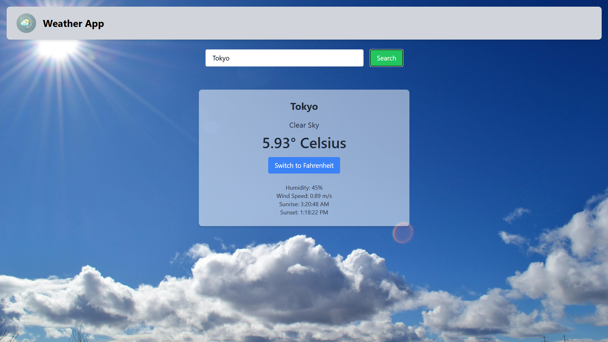

# ⛅ React Weather App

A modern, responsive weather application built with React that provides real-time weather information with a clean and intuitive interface.



## ✨ Features

- Real-time weather data display
- Detailed weather metrics (temperature, humidity, wind speed, etc.)
- Location-based weather detection
- Search functionality for any city worldwide
- Responsive design for all devices
- Beautiful weather animations
- Unit conversion (Celsius/Fahrenheit)

## 🌐 Live Preview

<div align="center">
  
### 🚀 [Experience the App](https://react-weather-app-jet-three.vercel.app/)
  
</div>

## 🛠️ Technologies Used

- React 18
- React Router v6
- Context API for state management
- Tailwind CSS for styling
- Axios for API requests
- OpenWeather API
- React Icons
- Day.js for date formatting

## ⚙️ Installation

1. Clone the repository:
```bash
git clone https://github.com/deepakpatil26/weather-app.git
```

2. Navigate to the project directory:
```bash
cd weather-app
```

3. Install dependencies:
```bash
npm install
```

4. Create a `.env` file in the root directory and add your OpenWeather API key:
```env
REACT_APP_WEATHER_API_KEY=your_api_key_here
```

5. Start the development server:
```bash
npm start
```

The app will be available at `http://localhost:3000`

## 📁 Project Structure

```
weather-app/
├── src/
│    |── components/
│   │   ├── Header/
│   │   ├── Search/
│   │   └── WeatherInfo/
│   ├── assets/
│   └── App.js
├── public/
└── package.json
```

## 🎯 Core Features Explained

### Current Weather Display
- Shows current temperature, weather condition, and location
- Displays additional metrics like humidity, wind speed, sunrise and sunset
- Dynamic weather icons based on current conditions

### 5-Day Forecast
- Daily temperature highs and lows
- Weather condition icons
- Precipitation probability
- Wind speed and direction

### Location Services
- Automatic location detection (with user permission)
- City search functionality with autocomplete
- Recent searches history

## 🤝 Contributing

Contributions are always welcome! Please follow these steps:

1. Fork the repository
2. Create a new branch: `git checkout -b feature-name`
3. Make your changes and commit them: `git commit -m 'Add some feature'`
4. Push to the branch: `git push origin feature-name`
5. Submit a pull request

## 📝 License

This project is licensed under the MIT License - see the [LICENSE.md](LICENSE.md) file for details.

## 🙏 Acknowledgments

- Weather data provided by [OpenWeather API](https://openweathermap.org/api)
- Icons from [React Icons](https://react-icons.github.io/react-icons/)
- Inspired by various weather apps in the React community

## 📧 Contact

For any questions or feedback, please reach out to:
- Email: deepakpatil2612@gmail.com
- GitHub: [deepakpatil26](https://github.com/deepakpatil26)